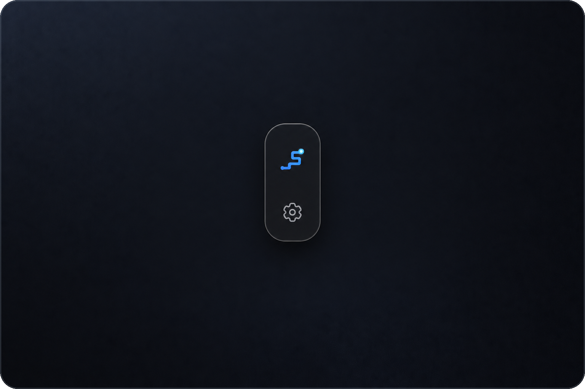
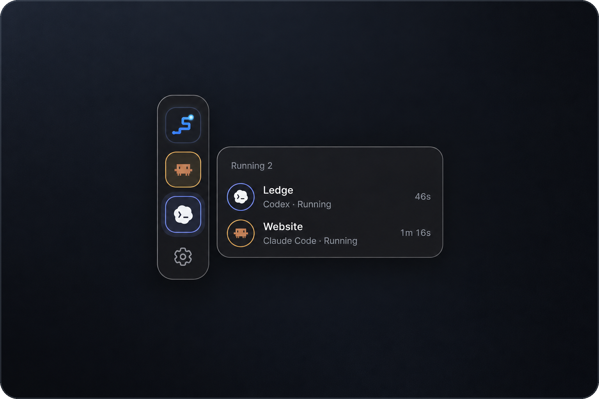
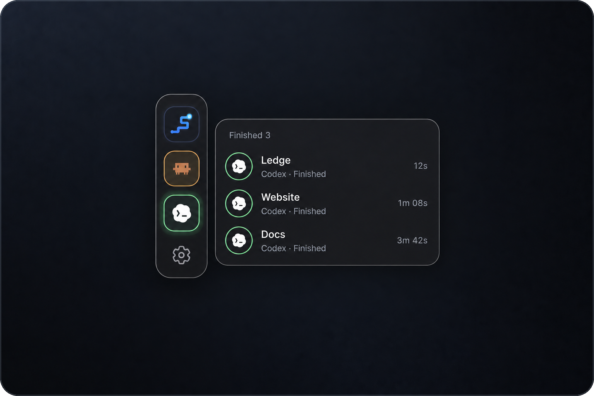
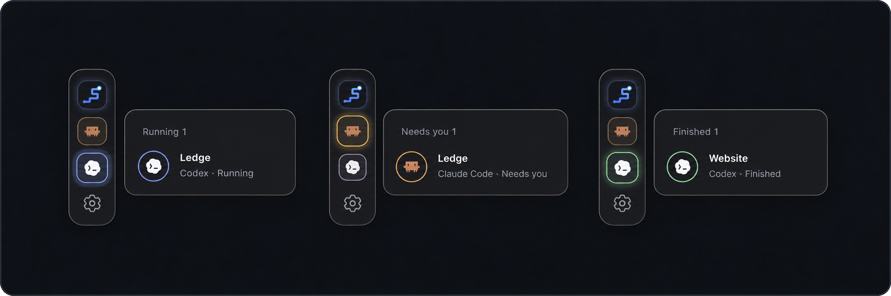

# Ledge

A small Mac widget that shows when Claude Code and Codex are working, waiting
for you, or finished. Works with local sessions only.

<p align="center">
  
</p>

## Install

Requires a Mac with Apple silicon (M1 or newer) and macOS 11 or later.

## Install

```sh
curl -fsSL https://raw.githubusercontent.com/smokey18/Ledge/main/scripts/install.sh | sh
```

<details>
<summary>Other ways to install</summary>

Grab the `.dmg` from the [latest release](../../releases/latest) and drag Ledge
into Applications. The first launch needs **System Settings → Privacy &
Security → Open Anyway**.

Or build it: `npm install && npm run tauri build`.

To check a download is genuine:

```sh
gh attestation verify Ledge_*.dmg --repo smokey18/Ledge
```

</details>

Open Ledge from Applications before starting your agent.

## Use

- Click an agent icon to see its sessions.
- Click a session to open its project folder in Finder.
- Turn on **Open at login** in Settings to start Ledge automatically.
- Use the menu bar icon to hide, show or quit Ledge.

<p align="center">
  
  
</p>

<p align="center">
  
</p>

## Development

Requires Rust and Node.js 20 or newer.

```sh
npm install
npm run tauri dev
npm run tauri build
cd src-tauri && cargo test
```

## License

[MIT](LICENSE) - Claude and OpenAI marks belong to their respective owners.
